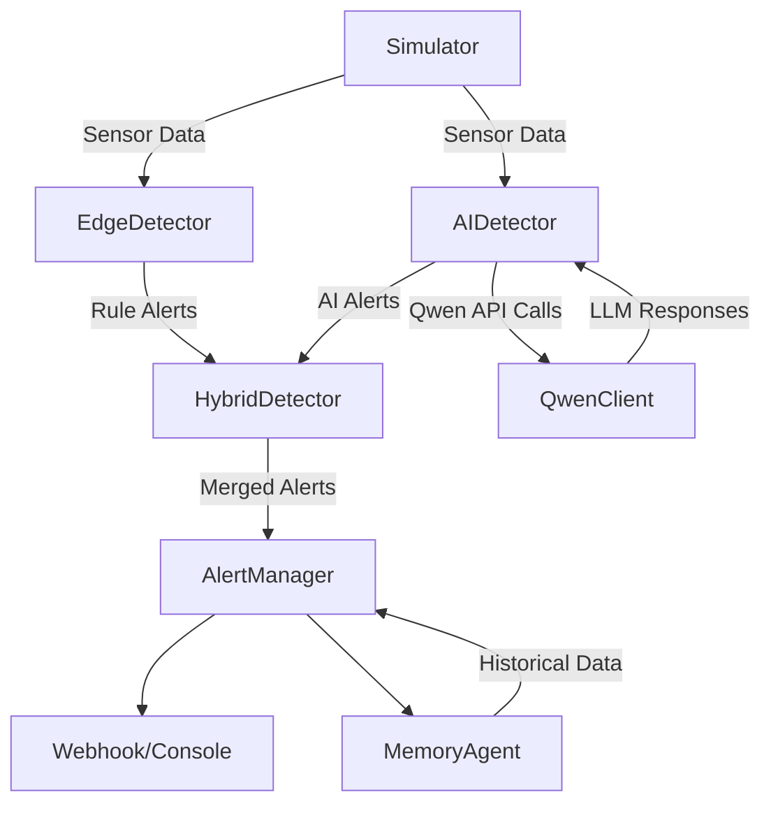
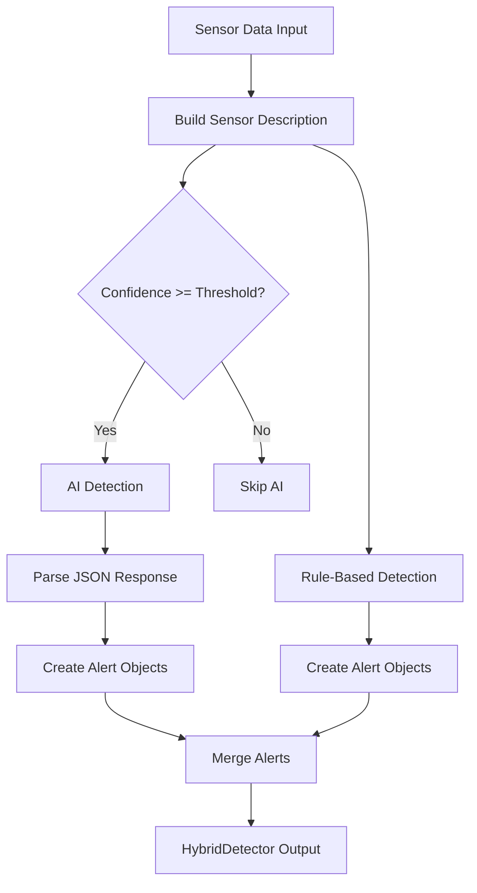

# Qwen-Sentinel

An intelligent environment monitoring agent built for the Qwen Cloud Hackathon. Qwen-Sentinel simulates and analyzes environmental sensor data (camera, temperature, motion, humidity, air quality) to detect anomalies such as overheating, intruders, high noise, low-light conditions, high humidity, and poor air quality — then persists trends and dispatches deduplicated alerts.

## Architecture

Qwen-Sentinel features a hybrid detection architecture combining fast rule-based detection with AI-powered analysis:



### Component Overview

**Data Layer:**
- simulator.py - Generates mock sensor payloads (camera, temperature, motion, humidity, air_quality)

**Edge Layer (src/edge/):**
- detector.py - EdgeDetector: Fast, deterministic rule-based anomaly detection
- ai_detector.py - AIDetector: AI-powered detection using Qwen LLM with few-shot learning
- hybrid_detector.py - HybridDetector: Combines rule-based and AI detection for comprehensive analysis

**Cloud Layer (src/cloud/):**
- qwen_client.py - QwenClient: Advanced client for Qwen Cloud API with function calling and few-shot learning
- memory.py - MemoryAgent: Persistent, file-backed history and trend queries
- alerts.py - AlertManager: Deduplicates/cooldowns alerts and dispatches via webhook or console

**Common Layer (src/common/):**
- models.py - Shared Alert, AlertCategory, Severity types
- config.py - Central threshold configuration

**Tests:**
- 12+ unittest suite covering all components including AI detection

## Features

### Core Monitoring
- Simulates multiple environmental states: normal, overheating, intruder detection, high noise, low light, high humidity, poor air quality
- EdgeDetector: Rule-based anomaly detection that turns a single sensor reading into zero or more Alert objects with configurable thresholds for temperature, motion/person, noise, brightness, humidity, and air quality

### AI-Powered Detection
- AIDetector: Uses Qwen LLM to analyze sensor data patterns beyond rule-based detection
  - Implements few-shot learning with pre-defined examples for consistent, high-quality detections
  - Returns structured JSON outputs with confidence scores
  - Configurable confidence threshold (default: 0.8)
  - Detects nuanced anomalies that rule-based systems might miss
  
- QwenClient: Full integration with Qwen Cloud API
  - Handles authentication and API calls
  - Supports function calling and structured outputs
  - Built-in few-shot learning examples for anomaly detection
  - Methods for summarization, anomaly detection, action suggestions, and anomaly explanation
  
- HybridDetector: Intelligent combination of both approaches
  - Runs rule-based detection first (fast, deterministic)
  - Optionally runs AI detection (smart, adaptive)
  - Merges results, prioritizing higher-severity AI detections
  - Provides detection summaries with both rule-based and AI alert counts

### Alert Management
- AlertManager that deduplicates alerts per category with a configurable cooldown so a sustained anomaly doesn't spam the same channel every cycle
- Dispatches via pluggable callbacks (defaults to console output)
- Webhook support for sending alerts to external services (Slack, Discord, custom APIs)

### Persistence
- MemoryAgent that keeps a rolling window of readings/alerts, optionally backed by a JSON file
- Category-count trend queries for historical analysis

## Usage

### Basic Monitoring (Rule-Based Only)

Run the sensor simulator standalone:
```bash
python3 simulator.py
```

Run the full monitoring loop with rule-based detection:
```bash
python3 cli.py --cycles 10
python3 cli.py --cycles 5 --state overheating
python3 cli.py --cycles 20 --memory-file memory.json --cooldown 15
```

Run with verbose output to see all sensor readings:
```bash
python3 cli.py --cycles 10 --verbose
```

### AI-Powered Monitoring

Enable AI detection with your Qwen Cloud API key:
```bash
python3 cli.py --cycles 10 --use-ai --qwen-api-key YOUR_API_KEY
```

Use environment variable for API key (recommended):
```bash
export Qwen_Cloud_API="your-api-key-here"
python3 cli.py --cycles 20 --use-ai
```

Adjust AI confidence threshold (default: 0.8):
```bash
python3 cli.py --cycles 15 --use-ai --ai-threshold 0.7
```

Combine with webhook alerts:
```bash
python3 cli.py --cycles 20 --use-ai --webhook-url https://hooks.slack.com/services/XXX/YYY/ZZZ
```

With all options:
```bash
python3 cli.py --cycles 50 --use-ai --qwen-api-key YOUR_KEY --ai-threshold 0.85 \
  --memory-file memory.json --cooldown 30 --webhook-url https://your-webhook-url.com \
  --interval 2 --verbose
```

### Webhook Alerts

Send alerts to Slack:
```bash
python3 cli.py --cycles 20 --webhook-url https://hooks.slack.com/services/XXX/YYY/ZZZ
```

Send alerts to Discord:
```bash
python3 cli.py --cycles 20 --webhook-url https://discord.com/api/webhooks/XXX/YYY --webhook-secret my-secret
```

### Running Tests

Run the complete test suite:
```bash
python3 -m unittest discover -s tests -v
```

Run specific AI component tests:
```bash
python3 -m unittest tests.test_ai_detector -v
python3 -m unittest tests.test_qwen_client -v
python3 -m unittest tests.test_hybrid_detector -v
```

## Extending the Project

### Adding New Sensor Types
1. Add new sensor type in simulator.generate_sensor_data()
2. Add detection rules to EdgeDetector in src/edge/detector.py
3. Add AI examples to AIDetector.FEW_SHOT_EXAMPLES for AI detection

### Customizing AI Detection
1. Modify few-shot examples: Edit AIDetector.FEW_SHOT_EXAMPLES to add domain-specific examples
2. Adjust confidence threshold: Change threshold parameter in AIDetector.__init__()
3. Add new anomaly types: Extend AIDetector._map_anomaly_type() with new mappings
4. Custom QwenClient: Subclass QwenClient to add custom API endpoints or processing

### Enhancing Detection Logic
1. Add new alert categories to src/common/models.py
2. Configure thresholds in src/common/config.py
3. Extend HybridDetector to add custom merging logic
4. Implement custom confidence scoring in AIDetector

### Extending Memory and Alerts
1. Extend MemoryAgent trend queries or swap JSON backing store for a real database
2. Add real dispatch mechanisms to AlertManager (email, SMS, webhook) by passing a custom dispatcher callable
3. Add persistence for QwenClient conversation history

### Integration Examples

Custom AI Model:
```python
from src.edge.ai_detector import AIDetector
from my_custom_llm import MyLLMClient

# Use custom LLM client
custom_client = MyLLMClient(api_key="...", model="my-model")
detector = AIDetector(qwen_client=custom_client, threshold=0.75)
```

Custom Webhook Dispatcher:
```python
from src.cloud.alerts import AlertManager

def my_dispatcher(alert):
    # Send to your custom service
    requests.post("https://my-service.com/alerts", json=alert.to_dict())

alert_manager = AlertManager(dispatcher=my_dispatcher)
```

## Hackathon Tracks

This project aligns with the following Qwen Cloud Hackathon tracks:

- MemoryAgent: Persistent memory of environmental states for trend analysis and historical pattern detection
- AI Showrunner: AI-powered anomaly detection could generate video summaries of environmental incidents
- Agent Society: Multiple sentinel agents collaborating across locations with shared memory
- Visual Understanding: Camera feed analysis for object detection, facial expressions, and motion tracking
- Productivity: Automating environment monitoring reduces manual checks and improves response times

## AI Detection Flow



## Requirements

- Python 3.8+ (standard library only, no external dependencies)
- Qwen Cloud API key (required for AI features)

## License

MIT
